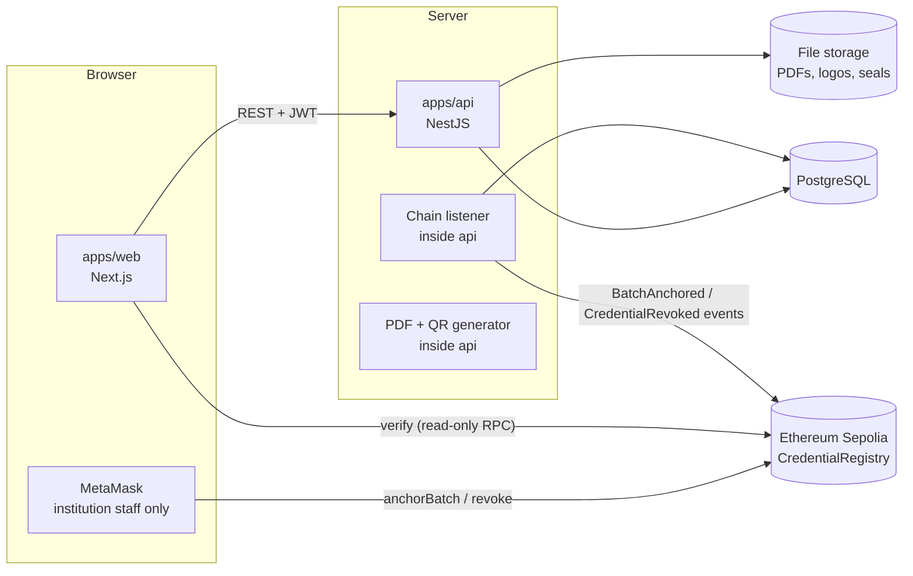
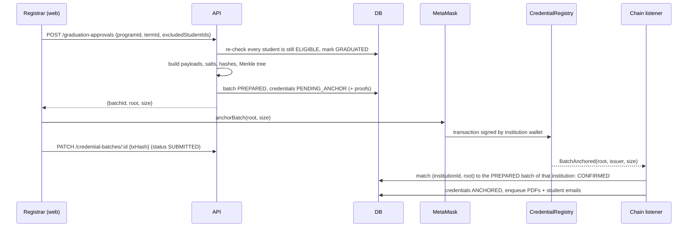
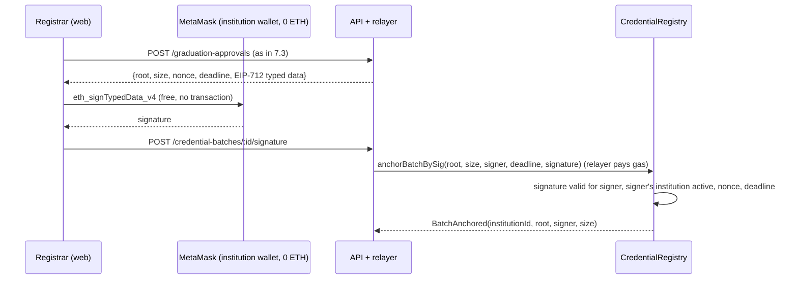

# Network of Trust (NoT) v2: Architecture

Status: accepted (2026-09-28). Replaces the v1 "everything on-chain" design, which is kept under `legacy/` for reference only.

## 1. What we are building

An academic management platform (a focused LMS: Learning Management System) for institutions, with **tamper-proof credentials**: any employer can verify a degree or transcript in seconds without contacting the university, and the check still works even if our own servers are down or were tampered with.

### Goals

- LMS core that feels as fast as any normal web app: universities, faculties, departments, programs, students, courses, terms, enrollments, exams, grades, statistics.
- Results publishing like the Ibn Al-Haytham platform: every course has assessment components (midterm, practical, oral, final written...) with max marks and credit hours; the system computes totals, letters, term GPA and cumulative GPA; results are published per term and grouped per academic year.
- Automatic graduation eligibility from the program bylaw (total credit hours, e.g. 144, category minimums, non-credit requirements such as Military Education), with one-click approval of a whole cohort that then issues the degrees in a single blockchain batch.
- Credentials (degrees, diplomas, certificates, transcripts) issued in batches, anchored on Ethereum, revocable, verifiable by anyone.
- Students and employers never need a crypto wallet. Only institution staff who issue credentials use one.
- No personal data on the blockchain, ever.

### Non-goals (v2)

- Proctoring (camera monitoring during exams). Documented as future work.
- Video lessons, assignments, online quizzes and course forums are **after the MVP** (ROADMAP Phase 7), not out of scope.
- Tokens, NFTs, payments.
- Mainnet deployment. We deploy to the Sepolia test network.

## 2. Hard rules

These are not preferences. A change that breaks one of them is a bug.

1. **Nothing personal on-chain.** The chain only stores 32-byte hashes, Merkle roots, institution addresses, timestamps and revocation reason codes.
2. **Tenant isolation.** Every row owned by an institution has `institutionId`. Every read and write is scoped to the caller's institution on the server. Every resource has an e2e test proving institution B cannot read or change institution A's data. (v1 failed this: see `docs/reviews/2026-09-28-v1-review.md`.)
3. **The server never holds an institution's private key.** Institutions authorize `anchorBatch` and `revoke` with their own wallet (MetaMask), either by sending the transaction or, with gas sponsorship (section 7.7), by signing a message our relayer submits. Our platform admin key only grants/removes the issuer role, and the relayer key only pays gas.
4. **Verification does not trust our server.** The verify page recomputes the hash in the browser and asks the blockchain directly.
5. **Issued credential data is immutable.** Once a credential is anchored its payload and salt never change. Corrections = revoke with reason `SUPERSEDED` + issue a new credential.
6. **Grades are editable until the term is published.** After that, changes need the `GRADE_CHANGE_AFTER_PUBLISH` workflow, and every change is written to an audit log (who, when, old value, new value, reason).
7. **Extend, don't modify.** A new university policy, rule, template, network, storage, notification channel or feature is added as a new class or new configuration row behind an existing extension point (section 9). Editing working code to add an `if (university === ...)` or `switch (type)` branch is a design bug.
8. **Check permissions, never position names.** Code asks "does this user hold `results.publish` for this student's faculty/department/level?", never "is this user the Dean?" (section 8).

## 3. System overview



### Monorepo layout

```
network-of-trust/
  apps/
    api/                 NestJS + Prisma (Phase 2+)
      src/core/          identity, org, academics, results, graduation, credentials, chain, verification
      src/features/      plugin features, one folder each (learning, relayer, ...)
      src/sdk/           the ONLY surface features may import from core (section 9.1)
    worker/              same codebase, runs outbox handlers and heavy jobs in a separate process
    web/                 Next.js App Router (Phase 2+)
      src/core/  src/features/  src/sdk/   same split for the UI
  packages/
    contracts/           Hardhat 2 project: CredentialRegistry.sol
    credential-core/     Shared TS: canonical JSON, credential hash, Merkle batch
  legacy/                v1 code, read-only reference, not built or tested
  docs/
    ARCHITECTURE.md      this file
    ROADMAP.md           phases and acceptance criteria
    plans/               one detailed implementation plan per phase
    reviews/             review of v1
  CLAUDE.md              rules for AI coding sessions
  package.json           npm workspaces
```

### Tech stack

| Layer | Choice | Why |
|---|---|---|
| Contracts | Solidity 0.8.24, Hardhat 2.29, OpenZeppelin Contracts 5.6 | Well documented, the team already knows Hardhat |
| Shared crypto | ethers 6, @openzeppelin/merkle-tree 1.0 | Same Merkle leaf format as OpenZeppelin `MerkleProof` in Solidity |
| API | NestJS, Prisma, PostgreSQL | Team knows NestJS + PostgreSQL |
| Web | Next.js (App Router), Tailwind, ethers `BrowserProvider` for MetaMask | Team knows Next.js and ethers |
| Auth | Email + password (argon2), JWT access token + refresh token in httpOnly cookie; SIWE for wallet linking | Students and employers never need a wallet |
| PDF | HTML template rendered to PDF with Puppeteer, QR with `qrcode` | Templates are just HTML/CSS |
| Networks | Hardhat local node for dev, Sepolia for the demo | Sepolia is the recommended Ethereum testnet for apps |

## 4. What lives where

| Data / action | Where | Notes |
|---|---|---|
| Users, roles, sessions | PostgreSQL | |
| Institution profile (ministry, university, faculty, logo, seal) | PostgreSQL + file storage | |
| Institution accreditation and its signer wallets | PostgreSQL **and** chain (`registerInstitution`, `addSigner`, `suspendInstitution`) | DB status drives the UI; the chain is what verifiers trust |
| Students, national ID | PostgreSQL | National ID encrypted at rest, never in credential payload |
| Departments, programs, courses, terms, enrollments | PostgreSQL | |
| Exams and results, statistics | PostgreSQL | Stats are SQL queries, not contract loops |
| Grades + audit log | PostgreSQL | |
| Credential payload + salt | PostgreSQL | Immutable after anchoring |
| Credential PDF | File storage | Regenerable from payload |
| Merkle root of a batch | **Chain** (`anchorBatch`) | One transaction per batch, any size |
| Revocation (+ reason code) | **Chain** (`revoke`) | Only the institution that anchored the batch |
| Emergency pause of writes | **Chain** (`pause`) | Verification keeps working while paused |

## 5. Credential model

### Payload (what gets hashed)

Defined in `packages/credential-core/src/credential-hash.ts`:

```ts
interface CredentialPayload {
  schema: "not.credential.v1";
  credentialId: string;                 // UUID
  institution: { id: string; name: string; issuerAddress: string };
  student: { fullName: string; studentNumber: string };
  award: {
    title: string;
    type: "DEGREE" | "DIPLOMA" | "CERTIFICATE" | "TRANSCRIPT";
    graduationDate: string;             // YYYY-MM-DD
    gpa?: string;                       // string, e.g. "3.45"
    honors?: string;
  };
  issuedAt: string;                     // ISO 8601 UTC
}
```

On-chain, an institution is identified by `institutionId = keccak256(utf8(payload.institution.id))` (ADR 0002). `payload.institution.issuerAddress` records the wallet that signed at issuance time; it is informational, verification uses the institution id.

Phase 4 adds optional award fields (`program`, `bylawVersion`, `earnedCredits`) for degrees. Adding optional fields is backward compatible: the hash formula below does not change, and credentials issued without them still verify.

### Hash

```
credentialHash = keccak256( canonicalJson({ v: 1, salt, payload }) )
```

- `canonicalJson` sorts keys, no whitespace (RFC 8785 subset). Same data, same string, same hash, on the server and in the browser.
- `salt` = 32 random bytes per credential. Without it, someone could guess a hash by trying common names and degrees.
- A frozen test vector in `credential-core` tests guarantees the formula never changes silently. Changing it would invalidate every issued credential.

### Batch (Merkle tree)

A **Merkle tree** combines many hashes into one hash (the **root**). For any single credential you can produce a short **proof** (a list of ~log2(N) hashes) showing it is inside the root. So one `anchorBatch(root, size)` transaction covers 1 or 10,000 credentials at the same gas cost (~51k gas, measured).

Leaf format (must match on both sides):

```
leaf = keccak256( bytes.concat( keccak256( abi.encode(credentialHash) ) ) )
```

This is exactly what `StandardMerkleTree.of(hashes.map(h => [h]), ["bytes32"])` produces and what `CredentialRegistry.leafOf()` computes.

## 6. Smart contract: `CredentialRegistry`

One contract, ~150 lines, no personal data. Source: `packages/contracts/contracts/CredentialRegistry.sol`.

| Function | Who | What |
|---|---|---|
| `registerInstitution(institutionId)` | Platform admin (`DEFAULT_ADMIN_ROLE`) | Accredit an institution (stable id) |
| `addSigner(institutionId, wallet)` / `removeSigner(wallet)` | Platform admin | Authorize or remove a wallet for that institution (onboarding, staff change, lost or stolen key). A wallet belongs to at most one institution |
| `suspendInstitution` / `reinstateInstitution` | Platform admin | Withdraw or restore accreditation |
| `anchorBatch(root, size)` | A signer of an active institution | Store the batch under `(institutionId, root)` with timestamp, size and signing wallet. Reverts on zero root, zero size, or the same institution anchoring the same root twice |
| `revoke(root, credentialHash, proof, reason)` | Any current signer of the institution that anchored `root` (including batches signed by its former wallets) | Mark one credential revoked. Proof must show the hash is in that batch. Reasons: 1 issued in error, 2 fraud, 3 superseded, 4 other |
| `verify(institutionId, root, credentialHash, proof)` | Anyone, even when paused | `institutionId` is always derived from `payload.institution.id`. Returns `{status: UNKNOWN / VALID / REVOKED, institutionActive, anchoredAt, signer, revokedAt, reason}` |
| `pause()` / `unpause()` | Platform admin | Blocks anchor and revoke only |
| `anchorBatchBySig(...)` / `revokeBySig(...)` | Anyone (our relayer), carrying the issuer's signature | Same effect as the direct calls, but the issuer only signs and the relayer pays gas. Added in ROADMAP Phase 6, see section 7.7 |

Design decisions:

- **An institution has a stable id; wallets are replaceable signers** (ADR 0002). Staff leave, laptops get lost, keys get stolen. Rotating a wallet (`addSigner` new, `removeSigner` old) keeps every old credential VALID with `institutionActive = true`, and the new wallet can still revoke credentials signed by the old one. A removed wallet can do nothing.
- **Batches are keyed by `(institutionId, root)`** (ADR 0001, 0002). A pending transaction is visible to everyone in the **mempool** (the queue of transactions not yet in a block). If batches were keyed by root only, institution B could copy A's root and anchor it first: A's transaction would fail and the root would belong to B. With the institution in the key, B's copy is a separate, meaningless entry. The verifier derives the institution id from the credential payload, and that payload is part of the hash, so it cannot be swapped.
- **Revocations are keyed by `(institutionId, root, credentialHash)`**. Institution B putting a copy of A's hash in its own batch and revoking it never touches A's credential. Both attacks have tests.
- **A suspended institution's old credentials stay VALID**, with `institutionActive = false` so the verify page can show a warning. They were legitimate when issued. A suspended institution can no longer anchor or revoke.
- **The admin address cannot be zero, and can be handed over** (ADR 0003). The deploy rejects `address(0)`; the admin can grant `DEFAULT_ADMIN_ROLE` to a new address (for example a multisig before any real deployment) and renounce its own. A test proves the handover.
- **Platform admin cannot revoke institution credentials.** Trust is not centralized in us.
- Future (not v2): make `DEFAULT_ADMIN_ROLE` a multisig (several people must sign).

## 7. Main flows

### 7.1 Institution onboarding

An **institution is a university**: it is the tenant and the on-chain issuer (Egyptian degrees are issued by the university). Faculties and departments live inside it.

1. University registers (email + password), fills its profile, and creates its faculties and departments. Status `PENDING`.
2. Institution admin links a wallet with SIWE (Sign-In With Ethereum: the wallet signs a message proving it owns the address). Saved as a pending `InstitutionSigner`.
3. Platform admin reviews and approves. API marks `APPROVED`; admin's browser calls `registerInstitution(institutionId)` then `addSigner(institutionId, wallet)`.
4. Chain listener sees `InstitutionRegistered` and `SignerAdded` and marks the institution `ISSUER_ACTIVE` and the signer active.

**Changing a wallet later** (staff change, lost or stolen key): institution admin links the new wallet with SIWE, platform admin approves, browser calls `addSigner(new)` and `removeSigner(old)` (for a stolen key, remove first). Listener updates `InstitutionSigner` from `SignerAdded` / `SignerRemoved`. Nothing already issued changes.

### 7.2 Results and graduation eligibility

**Academic structure.** University → Faculty → Department → Program (e.g. "Computer Science & Pure Mathematics"). A program has **bylaw versions** (اللائحة). Each student follows the bylaw version of their intake year, so changing the bylaw never changes the rules for students already enrolled.

**A bylaw version defines:**

- `totalCredits`, e.g. 144.
- Course categories with a minimum of credits each, e.g. University requirements, Faculty requirements, Major core, Major electives, Free electives.
- Grading scale: percentage range → letter → points, and which letters pass. Configurable per university.
- Optional per-component pass rule, e.g. a minimum percentage in the final written exam.
- Retake rule: how a course passed after failing counts (best attempt, or capped letter).
- Optional minimum cumulative GPA to graduate.
- **Non-credit requirements**: graduation conditions that are not courses, e.g. Military Education (التربية العسكرية), summer training, community service. Each has a scope: `UNIVERSITY` (recorded by a university office, applies to every faculty), `FACULTY` or `PROGRAM`. Per student it is `PENDING`, `COMPLETED` (date, recorded by) or `EXEMPT` (reason, approved by).

**Assessment components.** Each course offering defines its components and max marks, e.g. Midterm 20, Practical 20, Oral 10, Final written 50. Instructors enter component marks only. The system computes total %, letter, points and pass/fail. Nobody types a total or a GPA by hand.

**Publishing.** Marks stay hidden from students until the faculty registrar **publishes** the term. Publishing locks the term, then students see their results per term and per academic year (Fall + Spring + Summer). Changes after publishing go through the `GRADE_CHANGE_AFTER_PUBLISH` approval workflow (section 8) with a reason, and always write `GradeAudit` (rule 6).

**Computed, never typed:** term GPA, cumulative GPA, earned credits, credits per category, academic level. Saved as a snapshot per term so an old transcript can always be reproduced.

**Eligibility engine.** Runs when a term is published and whenever a non-credit requirement changes. For each affected student it checks the student's bylaw version: total credits, every category minimum, GPA rule, non-credit requirements. Output: `GraduationCheck { status: NOT_YET | BLOCKED | ELIGIBLE, missing: readable reasons }`. `BLOCKED` means all academic conditions are met but a non-credit requirement is missing (e.g. "Military Education: pending"). The engine never issues anything by itself.

**Approval queue (one button per step).** The graduation workflow (section 8) decides who acts and in which order. The person at the current step sees, per program and graduation term, e.g. "Computer Science & Pure Mathematics, Spring 2026: 212 eligible, 9 blocked". They can open any student (transcript + checks), exclude a student with a reason, then press **Approve**. When the last step (a holder of one of the university's signer wallets) approves, students become `GRADUATED` and all their degrees go into **one** Merkle batch with **one** signature (flow 7.3). Blocked students move to the queue automatically as soon as the missing requirement is recorded.

**Why this is not on-chain.** Rules, marks and eligibility get entered, corrected and recomputed all the time. Computing them in a contract is what made v1 slow and expensive (gas grew with every course, grades could not be corrected). The chain seals the **outcome** once a human approves it. The degree payload carries the program, bylaw version, earned credits and cumulative GPA, so those numbers are sealed too.

### 7.3 Issuing a batch



The listener, not the browser, is the source of truth for "anchored": the browser can close mid-way.

### 7.4 Verifying

1. Employer scans the QR or opens `/verify/{credentialId}` (or uploads a verification bundle JSON).
2. Web fetches `{payload, salt, root, proof, contractAddress, chainId}` from `GET /public/credentials/:id`.
3. Browser recomputes `credentialHash` with `credential-core`, then calls `verify(keccak256(payload.institution.id), root, hash, proof)` through a public RPC.
4. Page shows VALID / REVOKED (with reason) / UNKNOWN, issuer name (from API) and issuer address + active flag (from chain). If the recomputed hash does not match what the API claims, show "data was altered".

Students can download the **verification bundle** (the JSON above). It can be verified with a static page or a 20-line script even if our platform no longer exists.

### 7.5 Revoking

Institution admin picks a credential and a reason; browser calls `revoke(root, hash, proof, reason)` with MetaMask; listener updates the DB on `CredentialRevoked`.

### 7.6 Correcting a grade after issuance

Revoke with `SUPERSEDED`, fix the grade (through the `GRADE_CHANGE_AFTER_PUBLISH` workflow with a reason), issue a new credential in a new batch.

### 7.7 Gas sponsorship (institutions without ETH)

**Problem.** With direct calls, every institution needs a wallet funded with ETH to pay gas. Many institutions, especially public universities in Egypt, cannot buy or hold crypto (Egypt's Central Bank law 194/2020 restricts crypto dealing without a license; verify the current legal position before going live).

**Solution.** The institution **signs** the action for free; our **relayer** submits the transaction and pays the gas. The gas cost is billed inside the platform subscription in local currency.



**Contract additions** (OpenZeppelin `EIP712`, `Nonces`, `SignatureChecker`):

- `anchorBatchBySig(bytes32 root, uint32 size, address signer, uint256 deadline, bytes signature)`
- `revokeBySig(bytes32 root, bytes32 credentialHash, bytes32[] proof, uint8 reason, address signer, uint256 deadline, bytes signature)`
- Typed data: `AnchorBatch(bytes32 root,uint32 size,uint256 nonce,uint256 deadline)` and `Revoke(bytes32 root,bytes32 credentialHash,uint8 reason,uint256 nonce,uint256 deadline)`, domain name `"NoT CredentialRegistry"`, version `"1"`.
- The batch is recorded under the signer's institution, not `msg.sender`. All checks from the direct calls still apply (active institution, duplicate root, same-institution revoke, pause).
- A per-signer nonce makes every signature single-use; `deadline` limits how long it stays valid. `SignatureChecker` also accepts smart-contract wallets (ERC-1271), so an institution can later use a multisig.
- Anyone may submit a valid signature. That is safe: the signature only allows exactly what the institution signed.
- Direct `anchorBatch` / `revoke` stay available for institutions that do hold ETH.

**Relayer (inside `apps/api`):**

- Its own hot wallet, funded with a small ETH balance. It has **no role** in the contract: if stolen, the thief can only spend the gas balance.
- Per-institution quota (for example max batches per day), low-balance alert, retries with the same signature (idempotent: `BatchAlreadyAnchored` means this institution already anchored this root, so the relayer marks it done).
- Stores `gasUsed` and `effectiveGasPrice` per transaction for billing.

**Legal note.** Sponsorship moves the need to hold ETH from each university to the platform operator. Options for a real deployment: an operator entity in a jurisdiction where this is allowed, or a permissioned EVM network run by the Ministry or a university consortium (for example Hyperledger Besu) where gas has no market price. The contract is plain EVM code, so it runs unchanged on either.

## 8. Staff, positions and approval workflows

Every university and even every faculty organizes its administration differently (student affairs, graduates affairs, level officers, vice deans, deans, vice presidents, president...). So positions are **data**, not code. This is RBAC (Role-Based Access Control) with scopes.

### 8.1 Three layers

1. **Permissions** are fixed in code: the actions the system can perform. Examples: `marks.enter`, `results.review`, `results.publish`, `students.manage`, `requirements.record`, `graduation.prepare`, `graduation.approve`, `credentials.sign`, `credentials.revoke`, `bylaws.manage`, `staff.manage`, `workflows.manage`. Adding a feature may add permissions; it never renames or removes existing ones.
2. **Positions** are defined by each university: a name (Arabic and English) and a set of permissions. Example: "موظف شؤون طلبة" = `students.manage`, `marks.review`; "وكيل الكلية لشؤون التعليم والطلاب" = `results.publish`, `graduation.approve`. A permission belongs to the position, not to the person or their academic title.
3. **Assignments** link a user to a position with a **scope** and a **period**:

| Assignment | Faculty | Department | Level |
|---|---|---|---|
| Level 1 officer, Mathematics | Science | Mathematics | 1 |
| Level 1 officer, all departments | Science | (all) | 1 |
| Chemistry officer, all levels | Science | Chemistry | (all) |
| Head of Student Affairs | Science | (all) | (all) |
| Vice President for Education | (all) | (all) | (all) |

An empty scope field means "all". A user may hold several assignments. When someone leaves a position, their assignment gets an end date and a new one is created, so history always shows who held which position when they approved something.

A student's **level** is computed from earned credits using thresholds in the bylaw version, so "Level 1" scopes update automatically every term.

Access check (one function, used everywhere):

```
can(user, permission, target) =
  exists active assignment a of user where
    a.position has permission
    and (a.facultyId is null or a.facultyId == target.facultyId)
    and (a.departmentId is null or a.departmentId == target.departmentId)
    and (a.level is null or a.level == target.level)
```

### 8.2 Approval workflows

Sensitive actions are not done by one click of one person. Each university defines an ordered chain of steps per action; each step names the permission and the scope level required.

Actions with workflows: `RESULTS_PUBLISH`, `GRADE_CHANGE_AFTER_PUBLISH`, `GRADUATION_ISSUE`, `CREDENTIAL_REVOKE`. New actions can be added later without changing the engine.

Example default for `GRADUATION_ISSUE` (seeded, editable by the university):

1. Graduates Affairs prepares the cohort from the eligibility queue (`graduation.prepare`, faculty).
2. Vice Dean for Education and Students approves (`graduation.approve`, faculty).
3. Dean approves (`graduation.approve`, faculty).
4. Vice President for Education approves (`graduation.approve`, university).
5. A holder of a university signer wallet signs (`credentials.sign`, university); the batch is anchored.

Rules of the engine:

- **Four-eyes principle**: one person cannot act on two steps of the same instance.
- Any step can reject with a comment; the instance goes back to step 1.
- Every action stores user, assignment, decision, comment and time (`WorkflowAction`), and is shown on the student's and the cohort's history.
- Changing a workflow definition only affects new instances; running instances keep the version they started with.

The chain never reaches the blockchain except for its final signature. Later, a university signer wallet can be a **multisig** (for example 2 of 3: Dean, Vice President, President), so part of the real governance is also enforced on-chain.

### 8.3 Onboarding a university

We ship a **default Egyptian faculty template** (common positions + default workflows). During onboarding and training, our support team adjusts positions, scopes and workflows with the university. No code changes per customer.

## 9. Extensibility (how we add things later without rewriting old code)

Principle: **Open/Closed** (open for extension, closed for modification). Every place where universities differ, or where we already know a feature is coming, is an **extension point**: an interface with one or more implementations registered in a registry (the **Strategy pattern**). New behavior = new class + registration, or a new configuration row.

| Extension point | Interface | First implementations | Added later without touching old code |
|---|---|---|---|
| Grade to letter/points | `GradingPolicy` | Scale table from bylaw | Special scales, pass/fail courses |
| Retake counting | `RetakePolicy` | `BestAttempt`, `CappedLetter` | Any new university rule |
| Course pass rule | `PassRule` | `TotalPercent`, `ComponentMinimum` | Attendance-based rules |
| Graduation checks | `EligibilityRule` | `TotalCredits`, `CategoryMinimum`, `MinGpa`, `NonCreditRequirement` | Thesis, language test, anything new |
| Where marks come from | `MarkSource` | `ManualEntry`, `CsvImport` | `QuizResult`, `AssignmentGrade` (Phase 7) |
| Credential PDF | `CredentialTemplate` | Degree certificate | Transcript, diploma, per-university designs |
| How a batch reaches the chain | `AnchoringStrategy` | `DirectWallet` (Phase 4) | `SponsoredRelayer` (Phase 6) |
| Which chain | `ChainConfig` (config, not code) | Hardhat local, Sepolia | Polygon, a Ministry Besu network |
| File storage | `StorageProvider` | Local disk | S3-compatible storage |
| Notifications | `Notifier` | Email | SMS, WhatsApp |
| Approval chains | Workflow definitions (data) | Egyptian faculty template | Any university's real chain |

**Modules talk through events, not through each other's internals.** The API is a **modular monolith**: one deployable NestJS app split into modules (`identity`, `org`, `academics`, `results`, `graduation`, `credentials`, `chain`, `verification`, later `learning`, `relayer`). A module owns its tables and exposes a service; no module reads another module's tables. Cross-module reactions go through **domain events**, stored in an **outbox** table in the same database transaction so none are lost:

- `TermPublished` → graduation recomputes eligibility.
- `RequirementRecorded` → graduation recomputes that student.
- `GraduationApproved` → credentials builds the batch.
- `BatchAnchored` / `CredentialRevoked` → credentials updates status, notifications email students.

So Phase 7 (quizzes) only needs to emit `MarkProduced` and register a `MarkSource`; Phase 6 only registers `SponsoredRelayer`. Nothing already working is edited.

**Versioning instead of editing:** credential payload `schema` (`not.credential.v1`, later `v2`), bylaw versions, workflow definition versions, API under `/v1`.

**The contract is not upgradeable, on purpose.** An upgradeable contract means someone can change the rules after credentials were issued, which breaks trust. A new feature that needs the chain is a **new contract deployed next to the old one**; the verifier keeps a list of known registry addresses per chain, so old credentials verify forever against the contract that anchored them.

**Honest limit:** "never touch old code" is the goal, not a law of nature. Bug fixes and occasional refactors will still touch old code. Extension points make that rare and small, and the test suite catches regressions.

### 9.1 Big features as plugins, with fault isolation

Goal: after launch, a big new feature (for example the whole Learning module: videos, assignments, quizzes) is installed like a plugin. If it has a bug, the damage stays **inside that feature**; results, graduation, credentials and verification keep working.

**1. One-way dependencies (enforced in CI).**

```
features/*  ──may import──▶  sdk  ◀──implemented by──  core
core        ──never imports──▶ features/*
features/a  ──never imports──▶ features/b
```

The **SDK** (Software Development Kit) is a small, versioned set of interfaces that core exposes to features: `registerPermissions()`, `registerExtension(point, impl)`, `on(event, handler)`, `emit(event)`, `registerWorkflowAction()`, `registerMenuItem()`, `registerRoute()`, read-only query services (for example `students.findById`), `can()`. A feature talks to core only through it. An architecture test (`dependency-cruiser`) fails the build if any import breaks these arrows.

**2. Each feature owns its data.** Its tables live in its own PostgreSQL schema (for example `learning.*`) with its own migrations. A feature migration can never alter a core table. Uninstalling a feature = disabling it; its schema can be dropped without touching core data.

**3. Every feature has an on/off switch per university.** `FeatureFlag(institutionId, feature, enabled)`. A disabled feature: routes return 404, menu items disappear, event handlers are skipped. If a feature misbehaves in production, we turn it off in seconds, no redeploy. Also used for gradual rollout (enable for one pilot university first).

**4. Core never waits for a feature.** Core emits domain events through the outbox and continues. Feature handlers run in the **worker process**, each handler with its own retries, timeout and **dead-letter** list (failed events parked for inspection and replay). A crashing quiz handler cannot block publishing results.

**5. Two kinds of extension points.**

| Kind | Examples | If the plugin throws |
|---|---|---|
| **Critical** (changes an official outcome) | `GradingPolicy`, `RetakePolicy`, `PassRule`, `EligibilityRule` | The operation stops with a clear error and nothing is saved. Never guess an official grade or eligibility. |
| **Optional** (side effect) | `Notifier`, `MarkSource` from quizzes, menu items, dashboards widgets | Error is logged and alerted, core continues without it. |

**6. Heavy or risky work runs out of the API process.** Video processing, bulk PDF generation, large imports run in the worker (or later, a separate service). A memory leak or CPU spike there cannot freeze the API that students and employers use. Because module boundaries are already clean, any feature can later be moved into its own service without rewriting it.

**7. The UI is isolated too.** Each feature's pages are lazy-loaded routes wrapped in an **error boundary** (a React component that catches a crash and shows "this section is unavailable" instead of a blank app). Features add menu items and dashboard widgets through registered slots, not by editing core pages.

**8. A stable, versioned contract.** SDK interfaces and event payloads are versioned (`TermPublished.v1`). Core may add fields; it never removes or renames them within a major version. A feature built against SDK v1 keeps working after core updates.

**What this does not protect against:** a feature running inside the same API process can still, in the worst case, exhaust that process's memory. That is why heavy work goes to the worker and why the kill switch exists. Full isolation (separate service, separate database) is available when a feature grows big enough to need it.

## 10. Performance and optimization

Performance is a requirement from the first commit, not a clean-up phase. Every layer has **budgets** (numbers we must meet), **techniques** we use by default, and **measurements in CI** so a regression fails the build. Rule: no optimization without a measurement before and after, and no "it feels faster".

**Who sets the numbers.** The implementing Claude Code session measures the real system and owns the budgets. The table below says where each number comes from:

- **Measured**: already measured on the real code (the contract, Phase 1). Fact, not a guess.
- **Standard**: an industry threshold (Google's "good" Core Web Vitals). Kept unless there is a strong reason.
- **Starting target**: an estimate written before any code existed. In the phase that builds that part, the session measures a baseline on the real code and hardware, then confirms or changes the number in an ADR with the measurement attached, and updates this table.

Every optimization decision (cache, Redis, index, denormalization, moving work to the worker, rendering mode) must cite those measurements.

### 10.1 Budgets

| Layer | Metric | Budget | Source |
|---|---|---|---|
| Chain | `anchorBatch` gas | ≤ 55,000 regardless of batch size (measured: 53,740 for 1 credential, 53,752 for 10,000) | Measured |
| Chain | `revoke` gas | ≤ 70,000 (measured: 57,938 at 1 credential, 68,476 at 10,000) | Measured |
| Chain | `verify` | Free `view` call; proof length log2(N): 14 hashes for 10,000 credentials | Measured |
| API | Read endpoints | p95 ≤ 200 ms at 100 concurrent users on a 2 vCPU / 4 GB server with seed data | Starting target |
| API | Write endpoints | p95 ≤ 500 ms (heavy work is queued, not done in the request) | Starting target |
| API | Student results page data | p95 ≤ 150 ms, ≤ 5 SQL queries per request | Starting target |
| API | Any list endpoint | Paginated, max 100 rows per page, never unbounded | Design rule |
| Worker | Publish a term (2,000 students) | Snapshots + eligibility recomputed ≤ 60 s | Starting target |
| Worker | Build a batch of 2,000 degrees (hashes + Merkle tree) | ≤ 10 s, PDFs generated in the background | Starting target |
| Web | Core Web Vitals on a mid-range phone over 4G | LCP ≤ 2.5 s, INP ≤ 200 ms, CLS ≤ 0.1 | Standard |
| Web | JavaScript per route (gzipped, first load) | ≤ 170 KB; the wallet library is not in any route that does not need a wallet | Starting target |
| Web | Lighthouse performance score | ≥ 90 on login, student results, public verify | Standard |
| Verify page | Time to verdict on 4G | ≤ 3 s (one API call + one RPC call) | Starting target |

p95 means 95% of requests are at least this fast. LCP (Largest Contentful Paint) is when the main content appears, INP (Interaction to Next Paint) is how fast the page reacts to a click, CLS (Cumulative Layout Shift) is how much the layout jumps while loading.

### 10.2 Blockchain

- One transaction per cohort (Merkle batch), never per student. Cost does not grow with batch size.
- `Batch` is packed into **one storage slot** (uint64 timestamp 8 bytes + uint32 size 4 bytes + signer address 20 bytes = 32 bytes; the institution id is the mapping key), so anchoring is one storage write.
- Custom errors instead of revert strings, `calldata` for proofs, no loops, no arrays in storage, no on-chain lists. Lists are rebuilt from **events** by the listener.
- Verification is a `view` call: free for the verifier, no wallet needed.
- Listener reads logs in block ranges from a saved cursor with 2 confirmations, never "one RPC call per request".
- Gas budget assertions live in the contract test suite; `hardhat-gas-reporter` prints the table in CI.

### 10.3 Backend and database

- **NestJS on the Fastify adapter** instead of Express: lower per-request overhead; decision recorded as an ADR with a benchmark in Phase 2.
- **Indexes by design**: every foreign key, every `(institutionId, ...)` filter, every sort column. New queries on large tables are checked with `EXPLAIN ANALYZE`.
- **Keyset (cursor) pagination** instead of `OFFSET`, so page 500 is as fast as page 1.
- **No N+1 queries**: tests assert the number of SQL queries per endpoint (Prisma query events). N+1 means loading a list, then running one extra query per row.
- **Read models**: GPA, earned credits and per-offering statistics are computed once on publish (`TermSnapshot`, stats tables), not on every page view.
- **Bulk writes**: CSV imports and publishing use batched inserts/updates inside short transactions.
- **Heavy work in the worker** through a PostgreSQL-backed job queue (pg-boss): publishing, eligibility, PDFs, emails. The request returns immediately with a job id; the UI shows progress. Using PostgreSQL for the queue avoids adding Redis until a measurement says we need it.
- **Caching with clear rules**: anchored credential payloads never change, so the public verify response is cached with ETag (the server says "unchanged" instead of resending); revocation status is always read fresh. Configuration that rarely changes (bylaws, grading scales, permissions of a user) uses a small in-memory LRU cache (Least Recently Used: keeps the most recently used items, drops the oldest) invalidated by events.
- **Payload discipline**: select only needed columns, compress responses (gzip/brotli), no N-level nested includes.
- **Connection pooling** sized to the server; PgBouncer when there is more than one API instance.
- **Measure in production**: request duration and query duration in structured logs, slow query log for anything over 100 ms, `pg_stat_statements` enabled, a metrics endpoint.

### 10.4 Frontend

- **Server Components by default** (Next.js App Router): pages render on the server and ship little JavaScript; client components only where there is interaction.
- **Route-level code splitting**; `ethers` and MetaMask code are dynamically imported only on pages that sign or verify.
- **Streaming with Suspense**: the page shell appears immediately, slow parts fill in.
- **Long tables** (a cohort of 2,000 students): server pagination plus list virtualization (render only visible rows).
- **Fonts**: one Arabic + Latin font via `next/font`, subset, `display: swap`. **Images** via `next/image` with explicit sizes (no layout shift).
- Skeleton placeholders with fixed sizes, optimistic updates for small actions.
- **Budgets enforced in CI**: `size-limit` for JavaScript per route, Lighthouse CI on the three key pages.

### 10.5 How performance is checked

| When | What |
|---|---|
| Every PR | Contract gas assertions, SQL query-count tests, `size-limit`, Lighthouse CI |
| End of each phase | k6 load test on seeded data (k6 is a load-testing tool that simulates many users), results in the phase report |
| Before the demo | Full run on the target server, numbers in the final report |

## 11. Data model (overview)

Full Prisma schema is written in the Phase 2 and 3 plans.

**Identity and scope**

- `User(id, email unique, passwordHash, accountType PLATFORM_ADMIN|STAFF|STUDENT|EMPLOYER, institutionId?, status)`. What a STAFF user can do comes only from assignments (section 8).
- `Position(id, institutionId, name, nameAr, permissions text[], isTemplate)`
- `PositionAssignment(id, userId, positionId, facultyId?, departmentId?, level?, startsAt, endsAt?)`
- `WorkflowDefinition(id, institutionId, action, version, steps jsonb [{order, name, permission, scope FACULTY|UNIVERSITY}], active)`
- `WorkflowInstance(id, definitionId, definitionVersion, subjectType, subjectId, currentStep, status IN_PROGRESS|APPROVED|REJECTED)`
- `WorkflowAction(id, instanceId, step, userId, assignmentId, decision APPROVE|REJECT, comment?, at)`
- `OutboxEvent(id, type, version, payload jsonb, createdAt)` and `EventDelivery(eventId, handler, status PENDING|DONE|DEAD, attempts, lastError?)` for domain events, tracked per handler
- `FeatureFlag(institutionId, feature, enabled, updatedBy, updatedAt)`
- `Institution(id, chainId bytes32 = keccak256(id), name, nameAr, ministry, website, logoUrl, sealUrl, status PENDING|APPROVED|ISSUER_ACTIVE|SUSPENDED)` (a university)
- `InstitutionSigner(id, institutionId, address unique, status PENDING|ACTIVE|REMOVED, linkedBy, approvedBy, addedAt?, removedAt?)`
- `Faculty(id, institutionId, name, nameAr)`, `Department(id, facultyId, name)`

**Programs and bylaws**

- `Program(id, departmentId, name, nameAr, degreeTitle, degreeTitleAr)`
- `BylawVersion(id, programId, code e.g. "2018", firstIntakeYear, totalCredits, minCumulativeGpa?, gradingScaleId, retakePolicy, levelThresholds jsonb, eligibilityRules jsonb)`
- `CourseCategory(id, bylawVersionId, name, minCredits)` and `CategoryCourse(categoryId, courseId)`
- `GradingScale(id, institutionId, rows: [{minPercent, letter, points, passes}])`
- `NonCreditRequirement(id, institutionId, scope UNIVERSITY|FACULTY|PROGRAM, scopeId?, name, nameAr)`
- `StudentRequirement(studentId, requirementId, status PENDING|COMPLETED|EXEMPT, completedAt?, reason?, recordedBy)`

**Teaching and results**

- `Student(id, institutionId, facultyId, departmentId, programId, bylawVersionId, intakeYear, level (computed), userId?, studentNumber unique per institution, fullName, fullNameAr, nationalIdEnc?, email, status ACTIVE|GRADUATED|INACTIVE)`
- `Course(id, facultyId, code unique per institution, name, nameAr, creditHours)`
- `AcademicYear(id, institutionId, name e.g. "2025/2026")`, `Term(id, academicYearId, kind FALL|SPRING|SUMMER, status OPEN|PUBLISHED)`
- `Offering(id, courseId, termId, instructorId)`, `Enrollment(id, offeringId, studentId, attempt)`
- `AssessmentComponent(id, offeringId, name e.g. Midterm|Practical|Oral|Final, maxMarks, minPercentToPass?)`
- `ComponentMark(enrollmentId, componentId, marks, enteredBy, enteredAt)`
- `CourseResult(enrollmentId, totalPercent, letter, points, passed, countsTowardGpa)` (computed)
- `TermSnapshot(studentId, termId, termGpa, cumulativeGpa, earnedCredits, creditsByCategory jsonb)` (computed on publish)
- `GradeAudit(componentMarkId, before, after, reason, changedBy, at)`
- `Exam(id, offeringId, componentId?, title, startsAt, durationMin, room)` (the midterm exam feeds the Midterm component)

**Graduation and credentials**

- `GraduationCheck(studentId, status NOT_YET|BLOCKED|ELIGIBLE, missing jsonb, evaluatedAt)`
- `GraduationCohort(id, programId, termId, workflowInstanceId, excluded jsonb, batchId?)`
- `CredentialBatch(id, institutionId, merkleRoot unique, size, status PREPARED|SUBMITTED|CONFIRMED|FAILED, txHash?, blockNumber?, anchoredAt?)`
- `Credential(id, institutionId, studentId, batchId, payload jsonb, salt, credentialHash unique, proof jsonb, status PENDING_ANCHOR|ANCHORED|REVOKED, revokedReason?, pdfPath?)`
- `ShareLink(id, credentialId, tokenHash, expiresAt, viewCount)` for transcripts the student chooses to share
- `RelayedTx(id, institutionId, kind ANCHOR|REVOKE, refId, signature, txHash?, status QUEUED|SENT|CONFIRMED|FAILED, gasUsed?, effectiveGasPrice?, error?)` for gas sponsorship and billing
- `AuditLog(actorId, institutionId?, action, entity, entityId, before, after, at)`

## 12. Security and privacy checklist

- Passwords: argon2id. Rate-limit login and public verify endpoints.
- JWT access 15 min, refresh 7 days, httpOnly + SameSite cookie, rotation on use.
- National ID: AES-256-GCM encrypted column, key from env, shown masked.
- Public verify endpoint returns only the credential payload (name, award, dates). Transcripts need a student share link.
- Chain listener waits for N confirmations (2 on Sepolia) and is idempotent (re-processing the same event changes nothing).
- Front-running: batches are keyed by `(institutionId, root)`, so another institution anchoring our root first changes nothing for us (ADR 0001, 0002, contract test). A batch goes `FAILED` only if its transaction reverts or is dropped; then it is rebuilt with new salts and retried.
- Platform admin key: must be handed over to a multisig before any real (non-test) deployment (ADR 0003).
- Relayer key: separate from the platform admin key, holds only a small gas balance, no contract role. Stored as a server secret, rotated if leaked.

## 13. Glossary

- **Smart contract**: a program stored on the blockchain; anyone can read it, nobody can change its past records.
- **Transaction**: a signed write to the blockchain. Costs **gas** (a fee for computation and storage).
- **Hash (keccak256)**: a 32-byte fingerprint of data. Change one letter, the hash changes completely.
- **Salt**: random bytes mixed into the data before hashing so the hash cannot be guessed.
- **Merkle tree / root / proof**: see section 5.
- **Institution id (on-chain)**: `keccak256` of the institution's platform id; never changes.
- **Signer**: a wallet authorized to anchor and revoke for one institution; can be added and removed.
- **SIWE**: Sign-In With Ethereum (EIP-4361), proving wallet ownership by signing a message.
- **Testnet (Sepolia)**: a public Ethereum network with free test ETH, used for demos.
- **Multisig**: a wallet that needs several people to sign each transaction.
- **EIP-712**: a standard for signing structured data in a wallet; the user sees readable fields instead of a random hex string.
- **Relayer**: a server wallet that submits transactions signed-off by someone else and pays their gas.
- **Nonce**: a counter that makes each signature usable only once.
- **MVP**: Minimum Viable Product, the smallest version that real users can use end to end.
- **Bylaw (اللائحة)**: the official rules of a program: total credit hours, course categories, grading scale, graduation conditions.
- **Credit hours**: the weight of a course; a program is completed after passing a set number of them (e.g. 144).
- **GPA**: Grade Point Average, the credit-weighted average of course points (usually out of 4.0).
- **RBAC**: Role-Based Access Control; permissions are attached to positions, and people get positions.
- **Scope**: the part of the university an assignment covers (faculty, department, level).
- **Four-eyes principle**: an important action needs two different people.
- **Open/Closed principle**: add behavior by adding code, not by editing working code.
- **Strategy pattern**: several interchangeable implementations of one interface, chosen by configuration.
- **Modular monolith**: one application split into modules with strict boundaries.
- **ADR**: Architecture Decision Record, a short file explaining one important decision, the options compared and why.
- **p95**: the time within which 95% of requests finish.
- **Plugin / feature module**: a feature packaged so it can be switched on or off and depends on core only through the SDK.
- **SDK**: Software Development Kit, here the small set of interfaces core exposes to features.
- **Feature flag / kill switch**: a setting that turns a feature on or off without redeploying.
- **Dead-letter**: a list where failed events are parked for inspection and replay instead of being lost.
- **Error boundary**: a React component that contains a UI crash to one section of the page.
- **Domain event / outbox**: a message like "TermPublished" saved in the database in the same transaction as the change, then delivered to the modules that care.
